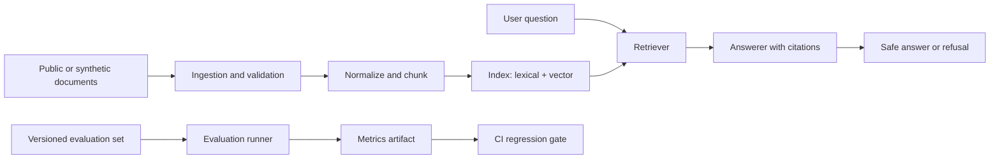

# Enterprise RAG Evals

## Status

**Design approved / implementation next**

This document describes the project to build. It is not evidence that the software, metrics, deployment, or provider integrations already exist.

## Problem

An operations team has procedures, product documentation, and incident records in Spanish. A user asks a question or describes an incident. The system should retrieve relevant evidence, answer with citations, suggest the next safe action, and refuse to invent an answer when the evidence is insufficient.

## Why it matters

A chat interface alone does not prove AI-engineering ability. This project makes the difficult parts visible: ingestion, retrieval quality, grounded answers, safe failure, API design, evaluation, observability, security, cost, and reproducible deployment.

The first baseline will be a simple keyword or lexical retrieval path. Semantic and hybrid retrieval must show a measured improvement on a versioned fixture set before being described as better.

## Architecture

Planned service boundaries:

- **Ingestion:** accepts PDF, Markdown, and plain text after file-type and size validation; records source metadata and a content hash.
- **Indexing:** normalizes and chunks content; supports a lexical baseline and a provider-neutral semantic adapter.
- **Retrieval:** returns evidence passages with source identifiers, scores, and bounded metadata.
- **Answering:** receives the question and retrieved evidence as untrusted context; returns a structured answer with citations or an insufficient-evidence refusal.
- **API:** exposes typed endpoints for ingestion, search, answering, and evaluation runs.
- **Evaluation:** stores dataset, prompt, model/provider, embedding, and configuration versions beside each result.
- **Operations:** emits request IDs, structured logs, timeouts, retries, latency, estimated token/cost fields, and local traces.

## Data and privacy

The public repository will use synthetic documents or public material with clear reuse rights. It will not require the user's private documents, academic records, employer data, or customer data.

The fixture pipeline will reject or redact obvious secrets and personal identifiers. The README will record the provenance and license of each public fixture before it is indexed.

## Evaluation

The versioned evaluation set will contain:

- Questions with expected evidence identifiers.
- Questions that should be answered with citations.
- Ambiguous questions that should trigger clarification or refusal.
- Questions with no supporting evidence that must not receive an invented answer.
- Prompt-injection text embedded inside retrieved documents.

The first report will measure retrieval hit rate, citation coverage, fixture-answer correctness, refusal behavior, latency, and estimated cost. Each result must include the command and artifact that produced it. CI will protect a documented regression tolerance after a baseline has been measured; no unsupported accuracy percentage will be placed in the README.

## Security and failure modes

The design treats documents and retrieved passages as untrusted content. Retrieved text must not override system instructions or permissions. Tests will cover malformed files, unsupported file types, empty indexes, ambiguous questions, prompt injection, provider timeout, retry exhaustion, and ungrounded answers.

Model/provider keys will be environment variables only. Error responses will not expose secrets, local paths, raw stack traces, or private document content. Rate-limit configuration, request IDs, structured logs, and bounded retries will be visible in the implementation when that slice exists.

## Local quick start

Not implemented yet. The first executable slice will document a command that loads one fixture document, builds the fixture index, asks one question, returns a cited answer, and runs one regression test without a paid model or hidden key.

## Evidence

Current evidence: design document and repository plan only. The next evidence gate is a passing fixture vertical slice plus a versioned evaluation artifact.

## Cost and latency

No live provider cost or latency is claimed yet. The implementation will record provider/model assumptions, request duration, retrieval duration, and estimated model cost when a provider adapter is added. Fixture mode must remain deterministic and free of external calls.

## What is not implemented

- No live model/provider integration.
- No public deployment.
- No customer or company data.
- No production SLA, security certification, or operational guarantee.
- No completed evaluation score.

## Next improvement

Implement the smallest vertical slice: fixture document -> validated ingestion -> fixture index -> question -> cited answer or refusal -> one regression test.
